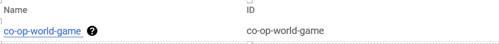
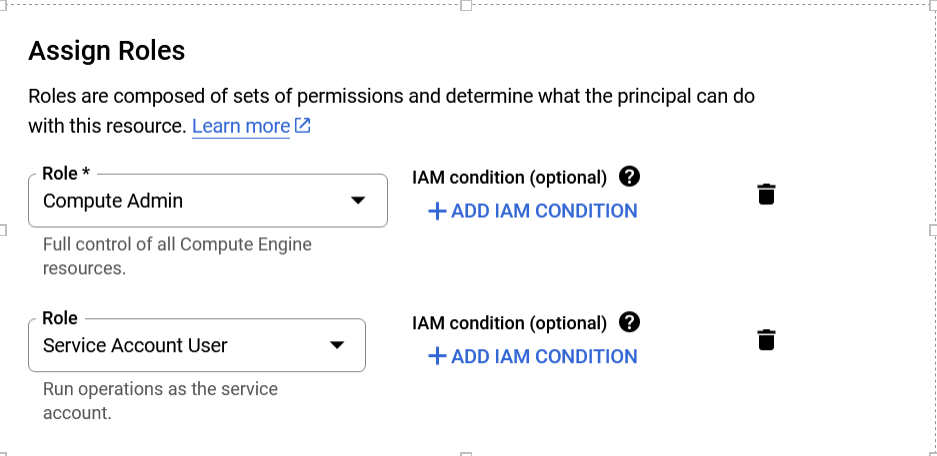
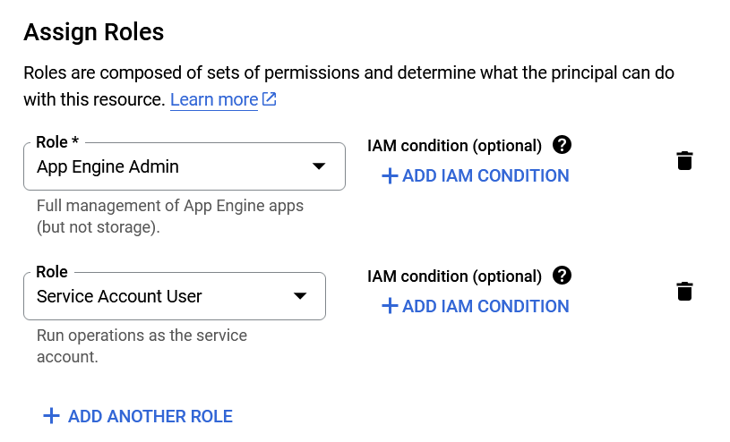

This section provides a detailed overview of how to grant appropriate permissions for both server-side and application-related operations within Google Cloud Platform (GCP), ensuring your development team has the necessary access to perform their roles effectively while maintaining operational security and integrity.

### Prerequisites

Before proceeding, ensure you have administrator-level access to the respective GCP project. This is required to perform the tasks outlined in this guide.

### Navigating to IAM & Admin

1. **Log in** to your GCP account.
2. Access the **IAM & Admin** dashboard from the main navigation menu to begin the process of assigning roles and permissions.

### Project Selection

- For **server-side operations**, select the project named **co-op-world-game**.
- For **application-related operations**, choose the project titled **co-op-world-server**.

### Server-side Operations Permissions

#### Compute Admin

- **Role**: `roles/compute.admin`
- **Purpose**: Grants full control over all compute resources, essential for managing and configuring servers.

#### Service Account User

- **Role**: `roles/iam.serviceAccountUser`
- **Purpose**: Allows actions on behalf of the service account, facilitating automated tasks and server-side resource management.

### Application Operations Permissions

#### App Engine Admin

- **Role**: `roles/appengine.admin`
- **Purpose**: Provides comprehensive management capabilities over App Engine applications, crucial for application deployment and maintenance.

#### Service Account User

- **Role Again**: `roles/iam.serviceAccountUser`
- **Purpose Again**: Enables actions as the service account, supporting application automation and integration with GCP services.

### Assigning Roles

To assign roles:

1. Navigate to the **IAM** section within the IAM & Admin dashboard.
2. Click the pencil icon next to the user or service account to modify permissions.
3. Use **+ADD ANOTHER ROLE** for each necessary role, selecting the appropriate roles from the dropdown menu.
4. (Optional) Apply IAM conditions for advanced access control, if needed.
5. Save your changes to apply the new permissions.
