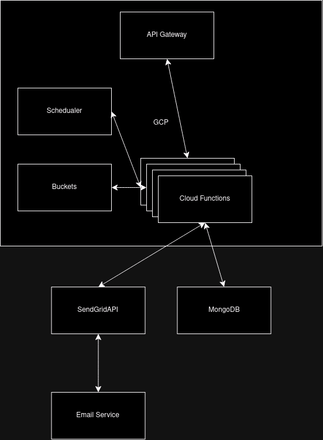

# Backend Architecture

This document provides an overview of the backend architecture of our application. The architecture leverages various Google Cloud Platform (GCP) services and other integrations to ensure robust and scalable operations.

## Components

### API Gateway
- The API Gateway serves as the entry point for all client requests. It routes requests to the appropriate cloud functions.

### Cloud Functions
- Cloud Functions are the core of the backend. They handle various operations such as data processing, database interactions, and external API calls.
- The functions are triggered by the API Gateway, Scheduler, or direct HTTP requests.

### Scheduler
- The Scheduler is used to trigger specific cloud functions at predefined intervals. It is primarily used for tasks that need to run periodically, such as data backups or cleanup operations.

### Buckets
- Buckets are used for storing and retrieving data. They are an integral part of the backup and restore processes.

### MongoDB
- MongoDB is the primary database used for storing application data. The cloud functions interact with MongoDB for all CRUD operations.

### SendGrid API
- The SendGrid API is used for sending emails. Cloud functions invoke this API to send notifications and other email communications.

### Email Service
- The Email Service component handles the actual sending of emails via the SendGrid API.

## Data Flow

1. **Client requests**: All client requests are routed through the API Gateway.
2. **API Gateway**: The gateway routes the requests to the appropriate cloud functions.
3. **Cloud Functions**: These functions perform various operations such as interacting with MongoDB, processing data, or invoking external APIs.
4. **Scheduler**: Triggers cloud functions at scheduled intervals for tasks like data backup.
5. **Buckets**: Used for storing backup data or other large data sets.
6. **SendGrid API**: Used by cloud functions to send emails.
7. **Email Service**: Sends out emails via the SendGrid API.

This architecture ensures a decoupled, scalable, and maintainable backend system that can efficiently handle various tasks and operations.
